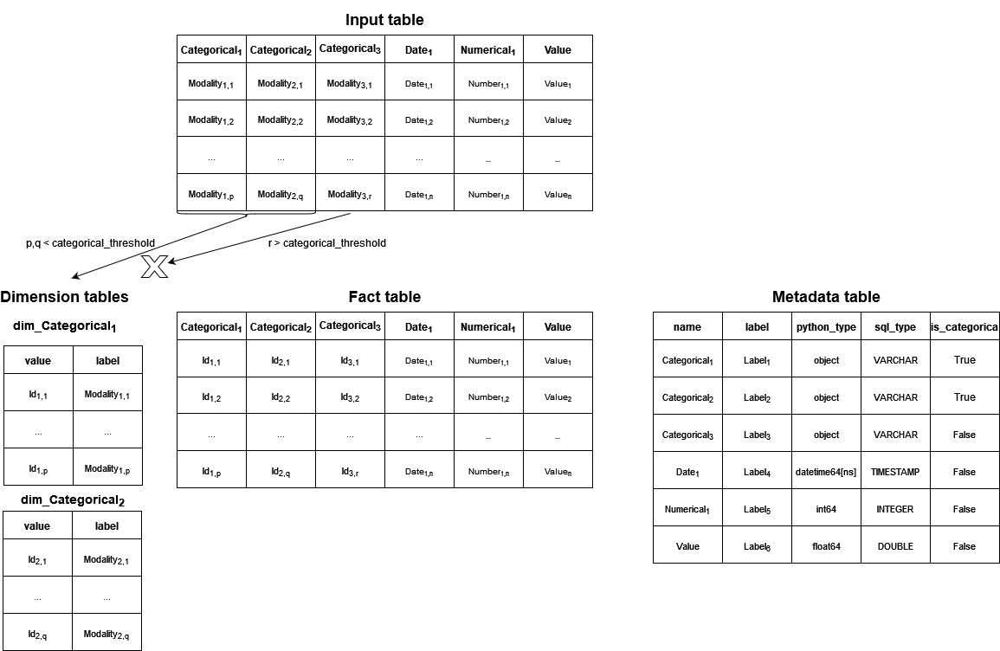

# Database schema builder for dashboard template

This package contains utilities to build a specific generic database scheme from a table.

## Objectives

This package is built to create :

* a generic schema to store a table as a database :

    - the `metadata` table references general information (label, type etc ...) about each dataframe column ;
    -  the `dimension` tables associate each modality of a categorical variable to an `id` used in the `fact` table ;
    - the `fact` table reflects the information in the original table ;

* export this schema a relational DuckDB database.



## Installation

### Package and dependencies

```bash
git clone https://github.com/qbolliet/dashboard-template-database.git
poetry build
pip install -e dist/dashboard_template_database-0.1.0-py3-none-any.whl
```

The package is then usable as any other python package.

### Parametrisation

File in the `config.yaml` file :
```yaml
INPUT_DATA : '../data/df_origin.csv'
OUTPUT_DATA : '../outputs/database.db'
THRESHOLD : 200
``` 

### Documentation

To visualize the documentation :
```
poetry install --with docs
```

```
mkdocs build --port 5000
```

## Usage

Here's an example of how to use the functions in the package:

```python
from bozio_wasmer_simulations import CaptationMarginaleSimulator

# Create a simulator object
simulator = CaptationMarginaleSimulator()

# Define a dictionary of reform parameters
reform_params = {
    'TYPE': 'fillon',
    'PARAMS': {
        'PLAFOND': 2.7,
        'TAUX_50_SALARIES_ET_PLUS': 0.35,
        'TAUX_MOINS_DE_50_SALARIES': 0.354
    }
}

# Simulate a reform
data_simul = simulator.simulate_reform(name='my_reform', reform_params=reform_params, year=2022, simulation_step_smic=0.1, simulation_max_smic=4)
``` 

## License

The package is licensed under the MIT License.